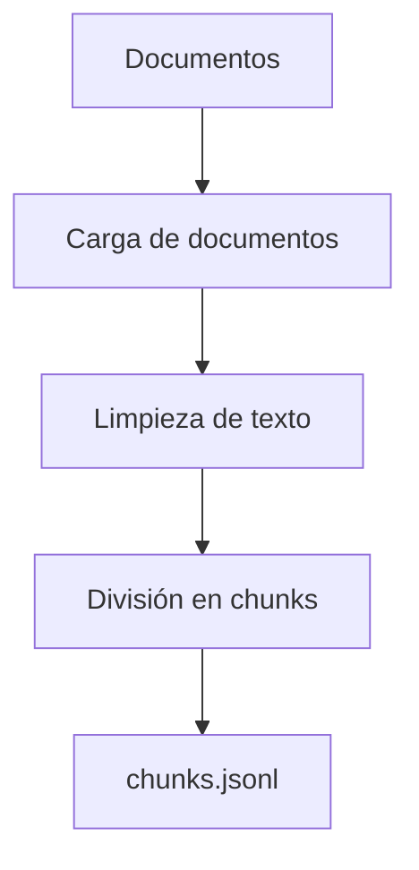

# Arquitectura por etapas para BlueSea Foods

## Objetivo

Construir progresivamente un asistente interno que responda preguntas de colaboradores usando documentos oficiales de BlueSea Foods.

El desarrollo se trabajará por tickets incrementales.

En este momento, el repositorio cubre:

- Ticket 1: organización, inventario y validación local de la colección documental.
- Ticket 2: lectura de documentos Markdown, limpieza de contenido, separación por secciones y generación de chunks con metadata.

Las siguientes etapas todavía no forman parte del alcance cerrado del repositorio.

## Arquitectura actual al cierre del Ticket 2

Al cierre del Ticket 2, la arquitectura ya no solo contempla la validación documental del Ticket 1. Ahora incluye también el procesamiento inicial de los documentos Markdown para convertirlos en fragmentos reutilizables por el futuro sistema RAG.

El Ticket 1 aporta la base documental: estructura de carpetas, inventario maestro, validación de archivos y control de estado.

El Ticket 2 agrega la primera capa de procesamiento: lectura de documentos `.md`, extracción de metadata, limpieza de contenido, división por secciones y generación de chunks.



## Estructura documental actual

```text
documents/
  corporate/
  hr/
  hse/
  inventory/
    BSF-INV-001_Document_Inventory.csv
  it/
  operations/
  quality/
```

Los documentos fuente se mantienen fuera de GitHub. El repositorio versiona la estructura, el inventario maestro, el codigo de validacion y la documentacion del ticket.

## Flujo general previsto

1. Inventario documental: lee `documents/inventory/BSF-INV-001_Document_Inventory.csv` e identifica codigo, categoria, responsable, estado y disponibilidad local.
2. Validacion documental: cruza cada registro del inventario contra las carpetas por area bajo `documents/`.
3. Procesamiento: carga documentos Markdown disponibles, limpia texto y preserva titulos y secciones utiles.
4. Chunking: divide el contenido en fragmentos pequenos con metadata.
5. Embeddings: convierte cada fragmento en un vector numerico comparable.
6. Base vectorial: guarda chunks y vectores para consulta.
7. Recuperacion: compara la pregunta contra los vectores y trae los fragmentos mas cercanos.
8. Generacion: redacta una respuesta usando solo el contexto recuperado y agrega citas.

## Alcance por ticket

| Ticket | Estado | Alcance |
| --- | --- | --- |
| Ticket 1 | En cierre | Inventario, categorias, responsables, estructura documental y validacion local. |
| Ticket 2 | Pendiente | Carga Markdown, limpieza, extraccion de secciones y chunking. |

### Componentes principales al cierre del Ticket 2

| Componente | Archivo | Función |
| --- | --- | --- |
| Inventario documental | `documents/inventory/BSF-INV-001_Document_Inventory.csv` | Define documentos esperados, códigos, áreas, responsables y clasificación. |
| Carga documental | `src/rag_bsf/document_loader.py` | Lee documentos Markdown y cruza información con el inventario. |
| Procesamiento de texto | `src/rag_bsf/text_processing.py` | Limpia contenido Markdown y divide el texto en secciones y chunks. |
| Pipeline principal | `src/rag_bsf/rag_pipeline.py` | Orquesta validación, inventario y procesamiento. |
| CLI del proyecto | `src/rag_bsf/cli.py` | Permite ejecutar comandos como `validate-documents`, `inventory` y `process`. |
| Script de procesamiento | `scripts/02_process.py` | Ejecuta directamente el procesamiento del Ticket 2. |
| Notebook de validación | `notebooks/02_ticket2_processing_chunks_colab.ipynb` | Permite probar el procesamiento en Colab. |                                                 |


## Salidas locales al cierre del Ticket 2

| Ticket | Archivo generado | Descripción |
| --- | --- | --- |
| Ticket 1 | `data/processed/document_status.csv` | Estado de validación de los documentos esperados. |
| Ticket 1 | `data/processed/inventory.json` | Inventario documental procesado en formato JSON. |
| Ticket 2 | `data/processed/chunks.jsonl` | Fragmentos limpios de documentos Markdown con metadata asociada. |

## Flujo general al cierre del Ticket 2

Al cierre del Ticket 2, el proyecto ya cuenta con la base documental organizada y con una primera salida procesada para continuar el pipeline.

1. Inventario documental: lee `documents/inventory/BSF-INV-001_Document_Inventory.csv` e identifica código, categoría, responsable, estado y disponibilidad local.

2. Validación documental: cruza cada registro del inventario contra las carpetas por área bajo `documents/`.

3. Procesamiento: carga documentos Markdown disponibles, limpia el texto y preserva títulos y secciones útiles.

4. Chunking: divide el contenido en fragmentos pequeños con metadata asociada.

5. Salida procesada: guarda los fragmentos generados en `data/processed/chunks.jsonl`.

A partir de este punto, las siguientes etapas del proyecto deberán tomar `data/processed/chunks.jsonl` como entrada principal.

## Metadata prevista para citas futuras

Todavía no forman parte del alcance cerrado:

- generación de embeddings;
- base vectorial;
- recuperación semántica;
- generación de respuestas con citas;
- agente de preguntas y respuestas.

Esta metadata se usara en tickets posteriores para recuperar contexto y citar fuentes en las respuestas.