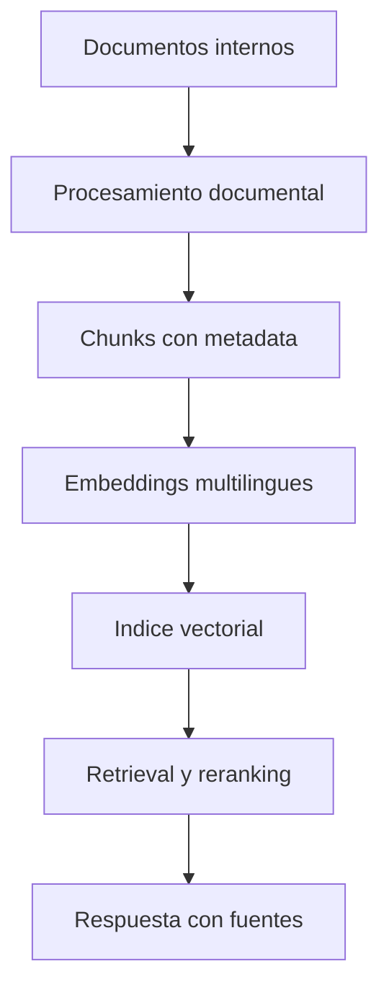

# Arquitectura BlueSea AI Assistant

## Objetivo

BlueSea AI Assistant es un asistente corporativo basado en RAG para consultar documentacion interna de BlueSea Foods. El sistema recibe preguntas en lenguaje natural, recupera fragmentos relevantes de los documentos internos y genera una respuesta sustentada en fuentes.

El objetivo principal es evitar respuestas inventadas: la respuesta debe depender del contexto documental recuperado y mostrar las fuentes usadas.

## Vista General


```mermaid
flowchart TD
    A["Documentos internos"] --> B["Procesamiento documental"]
    B --> C["Chunks con metadata"]
    C --> D["Embeddings multilingues"]
    D --> E["Indice vectorial"]
    E --> F["Retrieval y reranking"]
    F --> G["Respuesta con fuentes"]
```

## Flujo RAG

1. Los documentos fuente se guardan en `documents/<area>/`.
2. El inventario maestro se guarda en `documents/inventory/BSF-INV-001_Document_Inventory.csv`.
3. El comando `process` lee documentos, extrae texto, limpia contenido y crea chunks.
4. El comando `index` convierte los chunks en embeddings y crea el indice vectorial.
5. La interfaz Streamlit recibe la pregunta del usuario.
6. El sistema busca los chunks mas relevantes en el indice.
7. El modulo de respuesta genera una contestacion usando solo el contexto recuperado.
8. La app muestra respuesta, fuentes y estado del indice.

## Componentes

| Componente | Ruta | Funcion |
| --- | --- | --- |
| Interfaz | `app/streamlit_app.py` | Aplicacion principal en Streamlit |
| Estilos | `app/style.css` | Estilos visuales de la interfaz |
| Configuracion | `src/rag_bsf/config.py` | Rutas, categorias y parametros base |
| CLI | `src/rag_bsf/cli.py` | Comandos `process`, `index` y `ask` |
| Carga documental | `src/rag_bsf/document_loader.py` | Lectura de archivos fuente |
| Procesamiento | `src/rag_bsf/text_processing.py` | Limpieza, secciones y chunking |
| Pipeline RAG | `src/rag_bsf/rag_pipeline.py` | Orquestacion del flujo principal |
| Embeddings | `src/rag_bsf/embeddings.py` | Generacion de vectores semanticos |
| Vector store | `src/rag_bsf/vector_store.py` | Escritura y lectura del indice JSONL |
| Recuperacion | `src/rag_bsf/retrieval.py` | Busqueda semantica y reranking |
| Respuesta | `src/rag_bsf/answer_generation.py` | Construccion de respuesta con fuentes |
| Schemas | `src/rag_bsf/schemas.py` | Estructuras de datos del pipeline |

## Estructura del Proyecto

```text
bluesea-ai-assistant/
  app/
    streamlit_app.py
    style.css
    assets/
  data/
    processed/
      chunks.jsonl
      inventory.json
    index/
      vectors.jsonl
      embeddings_manifest.json
  documents/
    corporate/
    finance/
    hr/
    hse/
    inventory/
    it/
    legal/
    operations/
    quality/
  docs/
    architecture.md
    tickets/
  scripts/
  src/
    rag_bsf/
  tests/
  requirements.txt
  runtime.txt
  README.md
```

## Entradas

| Entrada | Ruta | Descripcion |
| --- | --- | --- |
| Documentos fuente | `documents/<area>/` | Documentos corporativos por categoria |
| Inventario maestro | `documents/inventory/BSF-INV-001_Document_Inventory.csv` | Control documental y metadata oficial |
| Variables de entorno | `.env` o Streamlit Secrets | Modelo de embeddings y parametros del modelo |

## Salidas

| Salida | Ruta | Descripcion |
| --- | --- | --- |
| Chunks | `data/processed/chunks.jsonl` | Fragmentos limpios con metadata |
| Inventario procesado | `data/processed/inventory.json` | Inventario normalizado |
| Indice vectorial | `data/index/vectors.jsonl` | Vectores usados para busqueda semantica |
| Manifest de embeddings | `data/index/embeddings_manifest.json` | Modelo usado para generar el indice |

## Categorias Documentales

| Carpeta | Categoria |
| --- | --- |
| `corporate` | Corporate Documents |
| `finance` | Finance |
| `hr` | Human Resources |
| `hse` | Health, Safety and Environment |
| `inventory` | Document Control and Inventory |
| `it` | Information Technology |
| `legal` | Legal / Compliance |
| `operations` | Operations |
| `quality` | Quality and Certifications |

## Modelo de Embeddings

El modelo recomendado para consultas en ingles y espanol es:

```text
sentence-transformers/paraphrase-multilingual-MiniLM-L12-v2
```

Este modelo permite recuperar documentos aunque la pregunta y el documento no esten escritos exactamente en el mismo idioma.

La configuracion puede definirse en `.env` local:

```env
EMBEDDING_MODEL=sentence-transformers/paraphrase-multilingual-MiniLM-L12-v2
```

O en Streamlit Secrets:

```toml
EMBEDDING_MODEL = "sentence-transformers/paraphrase-multilingual-MiniLM-L12-v2"
```

## Comandos Principales

Desde la raiz del proyecto:

```bash
PYTHONPATH=src python -m rag_bsf.cli process
PYTHONPATH=src python -m rag_bsf.cli index
streamlit run app/streamlit_app.py
```

Para hacer una pregunta desde CLI:

```bash
PYTHONPATH=src python -m rag_bsf.cli ask "What is the expense reimbursement policy?"
```

## Despliegue en Streamlit Cloud

Configuracion recomendada:

| Campo | Valor |
| --- | --- |
| Repository | `aantoa/bluesea-ai-assistant` |
| Branch | `main` |
| Main file path | `app/streamlit_app.py` |
| Python | `3.11` |

Archivos importantes para despliegue:

```text
runtime.txt
.streamlit/config.toml
requirements.txt
```

`runtime.txt` debe contener:

```text
python-3.11
```

`.streamlit/config.toml` debe contener:

```toml
[server]
fileWatcherType = "none"
```

Esta configuracion evita errores del watcher de Streamlit al inspeccionar dependencias opcionales de `transformers`, como `torchvision`.

## Reindexado

Si se agregan documentos nuevos o se cambia el modelo de embeddings, se debe recrear el indice:

```bash
rm -f data/index/vectors.jsonl data/index/embeddings_manifest.json
PYTHONPATH=src python -m rag_bsf.cli process
PYTHONPATH=src python -m rag_bsf.cli index
streamlit cache clear
streamlit run app/streamlit_app.py
```

## Criterios de Respuesta

El asistente debe:

- responder con base en documentos recuperados;
- mostrar fuentes cuando existan;
- evitar inventar informacion no respaldada;
- indicar cuando no hay evidencia suficiente;
- respetar la metadata documental disponible.

## Validacion

Comandos de validacion recomendados:

```bash
pytest
PYTHONPATH=src python -m rag_bsf.cli process
PYTHONPATH=src python -m rag_bsf.cli index
```

Para confirmar que el indice usa embeddings multilingues, revisar:

```text
data/index/embeddings_manifest.json
```

El campo del modelo debe coincidir con:

```text
sentence-transformers/paraphrase-multilingual-MiniLM-L12-v2
```